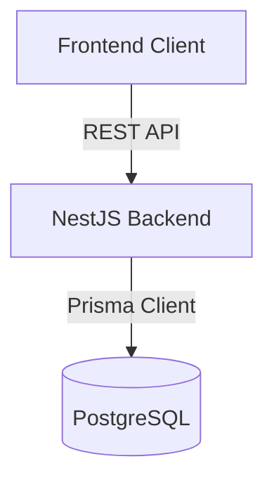

# TaskForge

TaskForge is a comprehensive project management system designed for engineering teams to track projects, assign tasks, and collaborate efficiently. Built with a modern monolithic repository structure, it leverages Next.js for a responsive frontend and NestJS for a robust backend architecture.

The application utilizes PostgreSQL and Prisma for relational data management, implements secure JWT authentication, and uses React Query and Tailwind CSS to deliver a premium, highly interactive user experience. Docker is integrated for streamlined database provisioning.

## Features

- Authentication: Secure email and password login using JSON Web Tokens.
- Role-based Authorization: Distinct access levels for Admin, Project Manager, and Team Member roles.
- Projects: Create, update, and manage engineering workspaces with calculated progress metrics.
- Tasks: Granular task tracking with assignments, due dates, and priority levels.
- Kanban: Interactive drag-and-drop board for visualizing and updating task statuses.
- Comments: Team collaboration through task-specific discussion threads.
- Notifications: In-app notification system with unread indicators and read receipts.
- Dashboard: High-level metrics, count-up statistics, and recent activity overview.
- Swagger: Automated OpenAPI documentation for the backend REST API.
- Seeder: Built-in database seeder for populating realistic engineering project data.
- CI/CD: Automated build and testing pipelines using GitHub Actions.
- Responsive UI: Fluid layouts optimized for desktop, tablet, and mobile viewing.

## Architecture



## Tech Stack

- Backend: NestJS, TypeScript, Node.js
- Frontend: Next.js, React, Tailwind CSS, Framer Motion
- Database: PostgreSQL, Prisma ORM
- Authentication: Passport.js, JWT, bcrypt
- Testing: Jest
- CI/CD: GitHub Actions

## Folder Structure

```text
taskforge/
├── .github/
│   └── workflows/        # GitHub Actions CI pipelines
├── apps/
│   ├── api/              # NestJS backend application
│   └── web/              # Next.js frontend application
├── common/               # Shared types, constants, and utilities
├── docker/               # Docker configuration files
├── docker-compose.yml    # Local development database orchestration
└── package.json          # Root workspace configuration
```

## Getting Started

### Prerequisites

- Node.js 22 or higher
- pnpm
- Docker

### Installation

1. Clone the repository and navigate to the project root.
2. Install dependencies for the entire workspace:

```bash
pnpm install
```

### Environment Variables

Duplicate the `.env.example` file in the `apps/api` and `apps/web` directories to `.env.local` or `.env` and update the connection strings and JWT secrets as necessary.

### Database Migration

Ensure Docker is running, then start the PostgreSQL instance:

```bash
docker-compose up -d
```

Apply the Prisma migrations to the database from the `apps/api` directory:

```bash
cd apps/api
pnpm prisma migrate dev
```

### Seeder

Populate the database with realistic demo data, including users, projects, tasks, and comments:

```bash
cd apps/api
pnpm db:seed
```

### Running the Application

Start the backend server:

```bash
cd apps/api
pnpm start:dev
```

Start the frontend development server:

```bash
cd apps/web
pnpm dev
```

## API Documentation

The backend exposes an interactive OpenAPI (Swagger) interface for exploring and testing endpoints. 

Once the backend is running, the documentation is available at:
`http://localhost:3001/api/docs`

## Testing

The backend includes a comprehensive suite of Jest unit tests covering core services.

Run the test suite from the `apps/api` directory:

```bash
pnpm test
```

To generate a coverage report:

```bash
pnpm test:cov
```

## CI/CD

The repository utilizes GitHub Actions for Continuous Integration. The pipeline is defined in `.github/workflows/ci.yml` and triggers on pushes and pull requests to main, develop, and feature branches. It runs parallel jobs to install dependencies, execute builds, and run tests for both the frontend and backend, ensuring code quality before integration.

## Demo Credentials

The following credentials can be used to log in after running the database seeder.

Admin
- Email: admin@taskforge.com
- Password: Password@123

Manager
- Email: sarah.manager@taskforge.com
- Password: Password@123

Member
- Email: john.dev@taskforge.com
- Password: Password@123

## Screenshots

### Dashboard


### Projects


### Tasks


### Notifications


## Future Improvements

- Profile Editing: Allow users to update their personal information and avatars.
- Password Management: Implement secure password change and reset flows.
- Activity Feeds: Introduce a system-wide activity log for auditing and tracking changes.
- Advanced Search: Implement server-side global search across all entities.

## License

MIT