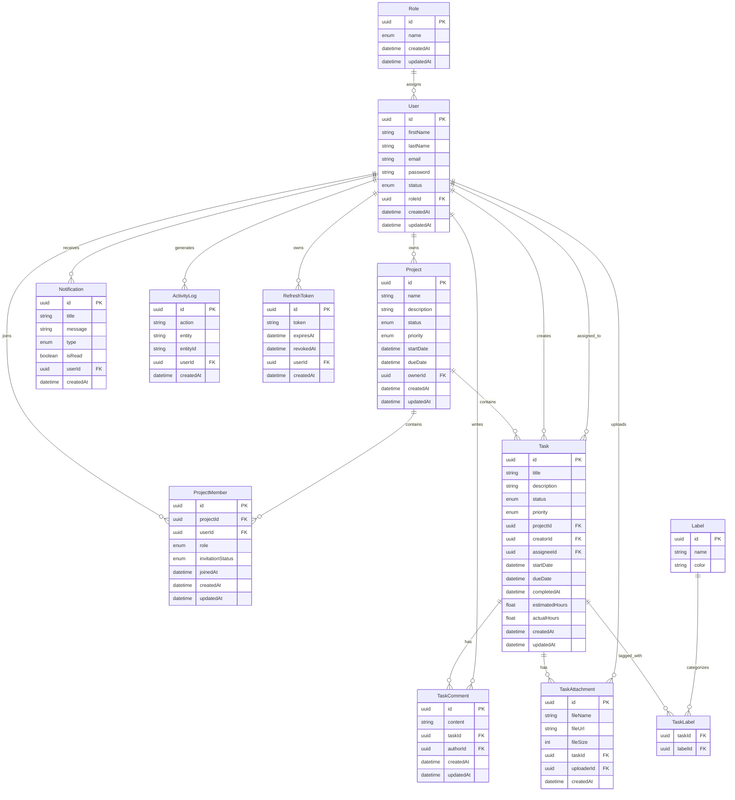

# Entity Relationship Diagram (ERD)

## Overview

The TaskForge database is designed using a normalized relational model. Core entities include users, roles, projects, tasks, comments, notifications, activity logs, and refresh tokens. Relationships are designed to minimize redundancy while maintaining referential integrity.

---

---

## Relationship Summary

| Parent | Child | Relationship |
|---------|-------|--------------|
| Role | User | One-to-Many |
| User | Project | One-to-Many |
| Project | ProjectMember | One-to-Many |
| User | ProjectMember | One-to-Many |
| Project | Task | One-to-Many |
| User | Task (Creator) | One-to-Many |
| User | Task (Assignee) | One-to-Many |
| Task | TaskComment | One-to-Many |
| User | TaskComment | One-to-Many |
| Task | TaskAttachment | One-to-Many |
| User | TaskAttachment | One-to-Many |
| Task | Label | Many-to-Many (via TaskLabel) |
| User | Notification | One-to-Many |
| User | ActivityLog | One-to-Many |
| User | RefreshToken | One-to-Many |

---

## Design Notes

- UUIDs are used as primary keys across all entities.
- Foreign key constraints enforce referential integrity.
- Junction tables (ProjectMember and TaskLabel) model many-to-many relationships.
- Cascade deletion is applied where appropriate to maintain data consistency.
- Database indexes are defined on frequently queried foreign keys and status fields to improve performance.