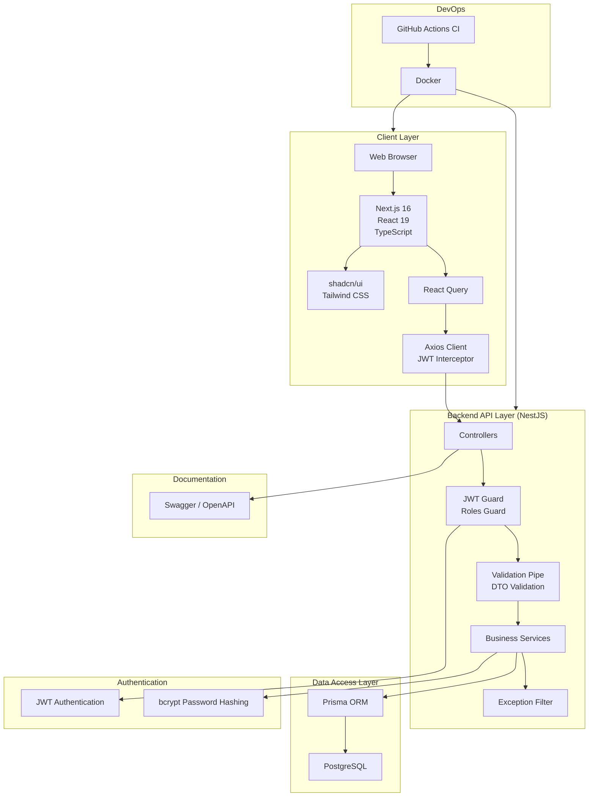

# System Architecture Diagram

## Overview

TaskForge follows a layered architecture that separates presentation, business logic, data access, and persistence. The frontend communicates with the backend through a REST API, while Prisma ORM manages database interactions with PostgreSQL. Authentication is handled using JWT, and continuous integration is provided through GitHub Actions.

---



---

# Request Flow

```text
User

↓

Next.js Frontend

↓

Axios

↓

JWT Authentication

↓

NestJS Controller

↓

Validation

↓

Business Service

↓

Prisma ORM

↓

PostgreSQL

↓

Response

↓

React Query Cache

↓

Updated UI
```

---

# Architectural Layers

| Layer | Responsibility |
|--------|----------------|
| Client Layer | User interface and interaction |
| API Layer | Business logic, validation, and authorization |
| Data Layer | Database access through Prisma ORM |
| Database | Persistent storage using PostgreSQL |
| Documentation | Interactive API documentation with Swagger |
| DevOps | Docker containerization and GitHub Actions CI |

---

# Security Architecture

TaskForge applies security at multiple layers:

- JWT Bearer Authentication
- Role-Based Access Control (RBAC)
- Password hashing using bcrypt
- DTO validation
- Global Validation Pipe
- Global Exception Filter
- Protected API endpoints

---

# Design Principles

The architecture was designed around the following principles:

- Separation of concerns
- Modular feature-based architecture
- Scalability
- Maintainability
- Type safety
- Security by default
- Production readiness