```mermaid
flowchart LR

%% ============================
%% Actors
%% ============================

Admin(["👤 Admin"])
PM(["👤 Project Manager"])
TM(["👤 Team Member"])

%% ============================
%% System Boundary
%% ============================

subgraph TaskForge["TaskForge System"]

UC1((Login))
UC2((Logout))

UC3((View Dashboard))

UC4((Create Project))
UC5((View Projects))
UC6((Edit Project))
UC7((Delete Project))

UC8((Manage Project Members))

UC9((Create Task))
UC10((View Tasks))
UC11((Update Task))
UC12((Delete Task))
UC13((Assign Task))
UC14((Update Task Status))
UC15((Kanban Drag & Drop))

UC16((View Task Details))
UC17((Add Comment))

UC18((View Notifications))
UC19((Mark Notification as Read))

UC20((View Profile))
UC21((Update Settings))

UC22((View Activity Feed))

end

%% ============================
%% Admin
%% ============================

Admin --> UC1
Admin --> UC2
Admin --> UC3

Admin --> UC4
Admin --> UC5
Admin --> UC6
Admin --> UC7

Admin --> UC8

Admin --> UC9
Admin --> UC10
Admin --> UC11
Admin --> UC12
Admin --> UC13
Admin --> UC14
Admin --> UC15

Admin --> UC16
Admin --> UC17

Admin --> UC18
Admin --> UC19

Admin --> UC20
Admin --> UC21

Admin --> UC22

%% ============================
%% Project Manager
%% ============================

PM --> UC1
PM --> UC2

PM --> UC3

PM --> UC4
PM --> UC5
PM --> UC6

PM --> UC8

PM --> UC9
PM --> UC10
PM --> UC11
PM --> UC13
PM --> UC14
PM --> UC15

PM --> UC16
PM --> UC17

PM --> UC18
PM --> UC19

PM --> UC20
PM --> UC21

PM --> UC22

%% ============================
%% Team Member
%% ============================

TM --> UC1
TM --> UC2

TM --> UC3

TM --> UC5

TM --> UC10
TM --> UC14
TM --> UC15

TM --> UC16
TM --> UC17

TM --> UC18
TM --> UC19

TM --> UC20
TM --> UC21

TM --> UC22
```

# Use Case Diagram

## Overview

The following diagram illustrates the primary interactions between the three system actors and the core functionality provided by TaskForge.

---

---

# Actor Responsibilities

| Actor | Responsibilities |
|--------|------------------|
| **Admin** | Full access to projects, tasks, members, notifications, and system management. |
| **Project Manager** | Manages projects, members, and tasks within assigned projects. |
| **Team Member** | Works on assigned tasks, updates task status, comments, views dashboard and notifications. |

---

# Functional Areas

## Authentication

- Login
- Logout

---

## Dashboard

- View statistics
- View recent projects
- View recent tasks
- View activity feed

---

## Project Management

- Create Project
- View Projects
- Edit Project
- Delete Project
- Manage Project Members

---

## Task Management

- Create Task
- View Tasks
- Update Task
- Delete Task
- Assign Task
- Update Task Status
- Drag & Drop Kanban

---

## Collaboration

- View Task Details
- Add Comments
- View Notifications
- Mark Notifications as Read

---

## User

- View Profile
- Update Settings

---

## Notes

- Authentication is required before accessing protected features.
- Role-Based Access Control (RBAC) determines which operations each actor can perform.
- Task status updates are reflected immediately in the Kanban board.
- Activity logs and notifications are generated automatically for supported actions.